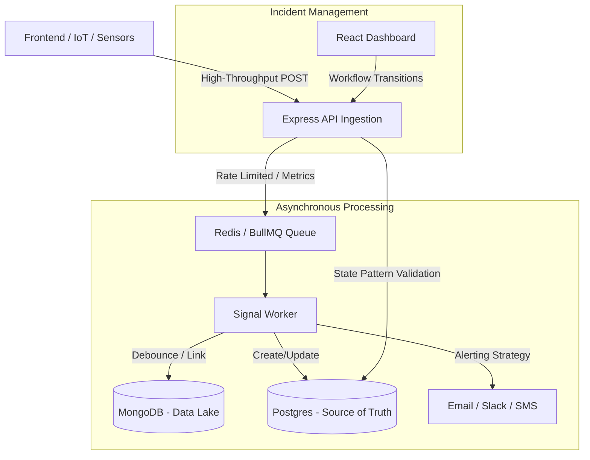

# Mission-Critical Incident Management System (IMS)

## 🏗️ Architecture Diagram



---

## 🚀 Key Features & Implementation

### 1. Ingestion & Backpressure Handling
The system handles bursts of up to **10,000 signals/sec**.
- **Strategy**: We decouple ingestion from persistence using a **Redis-backed BullMQ**.
- **Rate Limiting**: `express-rate-limit` prevents cascading failures by capping incoming requests at the API layer.
- **Metrics**: Throughput is logged every 5 seconds to the console for observability.

### 2. Debouncing Logic (100 signals threshold)
- **Logic**: For every component, we maintain a 10-second sliding window count in Redis.
- **Threshold**: Only after 100 signals arrive within the window is a **Work Item** created in PostgreSQL.
- **Linking**: Every subsequent signal is linked to the active `work_item_id` in MongoDB, providing a full audit trail.

### 3. Design Patterns Used
- **State Pattern**: Managed in `workItemState.js`. Ensures transitions like `OPEN -> CLOSED` are only possible if a mandatory RCA is provided.
- **Strategy Pattern**: Managed in `alertingStrategy.js`. Swaps alerting logic based on component type (e.g., P0 for RDBMS, P2 for Cache).

### 4. Timeseries & Aggregations
- **API**: `GET /api/work-items/stats` returns real-time incident counts grouped by status.
- **Frontend**: A global stats banner at the top of the dashboard provides instant visibility into system health.

### 5. Resilience & Security
- **Retry Logic**: BullMQ is configured with a **3-attempt exponential backoff** strategy for worker jobs.
- **Deep Health Checks**: The `/health` endpoint performs recursive connectivity checks for MongoDB, PostgreSQL, and Redis.
- **API Security**: 
    - **Ingestion**: Protected via `X-API-KEY` header validation.
    - **Dashboard**: Protected via `Authorization: Bearer` JWT validation (Mock).
- **Structured Logging**: All system events and metrics are logged in **JSON format** for production auditability.
- **Graceful UI**: Integrated `react-hot-toast` for non-blocking user feedback on all incident transitions.

---

## 🧪 Testing
### Unit Tests (RCA Validation)
```bash
cd backend
npm test
```

### Integration Tests (Full Pipeline)
```bash
cd backend
npm run test:integration
```


---

## 🛠️ Setup Instructions


### 1. Prerequisites
- Docker & Docker Compose
- Node.js 18+

### 2. Start Infrastructure
```bash
docker-compose up -d
```

### 3. Start Backend
```bash
cd backend
npm install
npm start
```

### 4. Start Worker
```bash
cd backend
node src/workers/signalWorker.js
```

### 5. Start Frontend
```bash
cd frontend
npm install
npm start
```

### 6. Run Stress Test
```bash
node mock_signals.js
```

---

## 📊 Backpressure & Resilience
Backpressure is managed by the **Consumer-Pull model** of BullMQ. If the database (Postgres/Mongo) becomes slow, the Redis queue acts as a buffer. The worker processes jobs at its own pace, preventing the persistence layer from being overwhelmed. The `ingestionLimiter` at the API layer acts as a "circuit breaker" to drop traffic if it exceeds system capacity.
